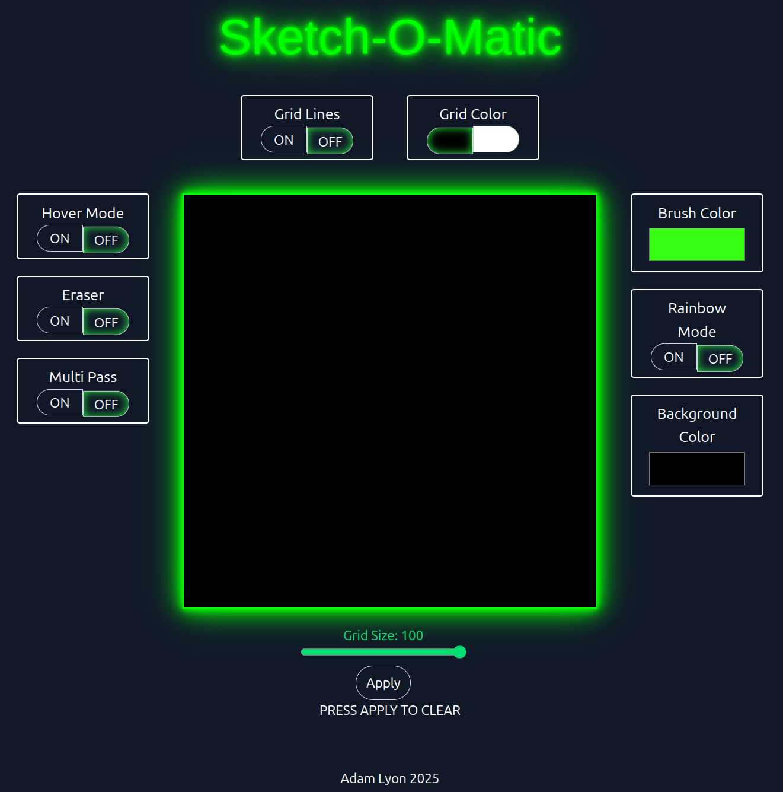

# Sketch-O-Matic Application

## Project Description
From The Odin Project - Fundamentals, this is a simple etch-a-sketch style application.  It features customizable brush, background and grid size options.  It is designed to be user friendly and visually appealing.

## User Interface

## Features
- Grid line visibility toggle
- Grid line color choice of black or white
- Color picker for brush color
- Rainbow mode (randomly assigns color to each cell)
- Color picker for background color
- Hover mode toggle, where holding the left mouse button is not needed to color a cell
- Eraser mode toggle.  Clears each cell of its current color
- Multipass mode.  It takes several passes to fully color in each cell.
- Grid size selection of 10x10 to 100x100
- A clip art paintbrush replaces the mouse cursor over the grid

## How to Run the Project
Save the following files in a directory:
index.html
output.css
script.js
images/paintbrush.png

Open index.html in any modern web browser to start creating art!

## Technologies Used
HTML: For structuring the user interface.
TailwindCSS-CLI / CSS: For styling the user interface.
JavaScript: For implementing functionality and interactivity.